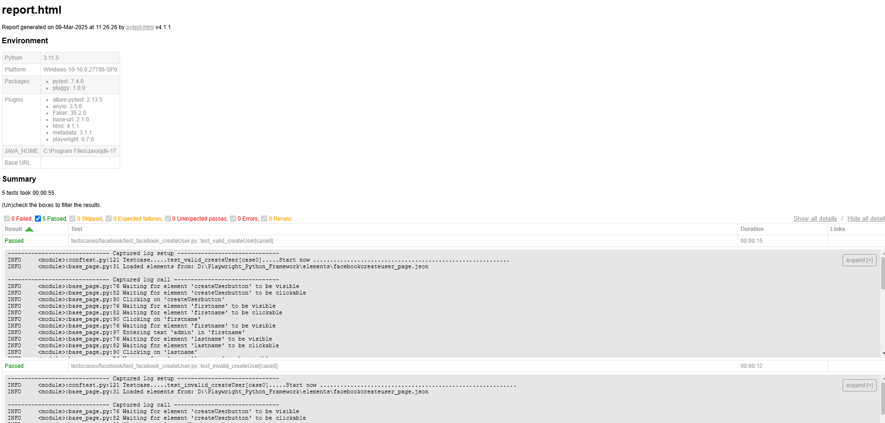

# Playwright Python Automation Framework

This is a robust and scalable automation framework built using **Playwright** and **Python**. It follows the **Page Object Model (POM)** design pattern and supports cross-browser testing, cloud testing (BrowserStack/LambdaTest), and environment-specific configurations.

---

## Features

- **Cross-Browser Testing**: Supports Chromium, Firefox, and WebKit browsers.
- **Cloud Integration**: Works with BrowserStack and LambdaTest for cloud-based testing.
- **Environment Configuration**: Easily switch between `dev`, `qa`, and `prod` environments.
- **Page Object Model**: Clean separation of test logic and page-specific actions.
- **Custom Logging**: Integrated logging for better debugging and traceability.
- **Parallel Execution**: Supports parallel test execution using `pytest-xdist`.
- **HTML Reports**: Generates detailed HTML reports for test execution.
- **Reusable Utilities**: Common functions like waits, screenshots, and assertions.

---

## Framework Structure

```
project-root/
│
├── config/
│   ├── __init__.py
│   ├── config.py            # Environment configuration
│   ├── browser_capabilities.py  # Browser/cloud capabilities
│   └── environments/
│       ├── .env.dev         # Dev environment variables
│       ├── .env.qa          # QA environment variables
│       └── .env.prod        # Prod environment variables
│
├── elements/
│   ├── facebookCreateuser_page.json      # Login page locators
│   └── facebooklogin_page.json       # Home page locators
│
├── pages/
│   ├── __init__.py
│   ├── base_page.py         # Base page class
│   ├── facebook_createuser_page.py        # Login page actions
│   └── facebook_login_page.py         # Home page actions
│
├── fixtures/
│   ├── __init__.py
│   └── pages.py             # Page object fixtures
│
├── utils/
│   ├── __init__.py
│   ├── file_reader.py       # Read test json data
│   ├── functions.py         # Reusable functions
│   ├── waits.py             # Custom wait strategies
│   └── logger.py            # Logging configuration
│
├── testscases/
│   ├── __init__.py
│   ├── conftest.py          # Pytest fixtures & hooks
│   └── facebook/
│       ├── test_facebook_createUser.py    # create user cases
│       └── test_facebook_login.py         # login page test cases
├── testdata/
│   │  
│   └── facebook/
│       ├── facebook_createuser_data.json    # create user  test data
│       └── facebook_login_data.json         # login page test data
│              
├── pytest.ini               # Pytest configurations
├── requirements.txt         # Dependencies
│
├── reports/                 # Test reports (auto-generated)
└── logs/                    # Execution logs (auto-generated)
```

---

## Prerequisites

- Python 3.8 or higher
- Playwright (`pip install playwright`)
- BrowserStack/LambdaTest credentials (for cloud testing)

---

## Setup

1. **Clone the Repository**:
   ```bash
   git clone https://github.com/DipankarDandapat/Playwright_Python_Framework.git
   cd Playwright_Python_Framework
   ```

2. **Install Dependencies**:
   ```bash
   pip install -r requirements.txt
   playwright install
   ```

3. **Set Up Environment Variables**:
   - Create `.env.dev`, `.env.qa`, and `.env.prod` files in the `config/environments/` folder.
   - Example `.env.dev`:
     ```ini
     BASE_URL=https://dev.example.com
     BROWSERSTACK_USERNAME=your_username
     BROWSERSTACK_ACCESS_KEY=your_access_key
     LT_USERNAME=your_username
     LT_ACCESS_KEY=your_access_key
     TIMEOUT=30
     ```

4. **Run Tests**:
   - Local Browser with chromium:
     ```bash
     pytest testscases/facebook/ --cloud local --browser-engine chromium --env dev
     ```
   - headless Off mode:
     ```bash
     pytest testscases/facebook/ --cloud local --browser-engine chromium --headless false --env dev
     ```
   - BrowserStack:
     ```bash
     pytest testscases/facebook/ -s -v --cache-clear --cloud browserstack  --env prod
     ```
   - LambdaTest:
     ```bash
     pytest testscases/facebook/ -s -v --cache-clear --cloud lambdatest  --env prod
     ```

---

## Writing Tests

### Example Test Case

```python
import pytest

@pytest.mark.smoke
@pytest.mark.regression
@pytest.mark.parametrize("case", testcasedata["positive"])
def test_valid_login(facebook_login_page,case):
    facebook_login_page.navigate_to_facebook()
    facebook_login_page.enter_credentials(case["usename"], case["password"])
    facebook_login_page.click_loginbutto()
```

### Example Page Object

```python
from .base_page import BasePage

class FacebookLoginPage(BasePage):
    def __init__(self, page: Page,app_config):
        super().__init__(page)
        self.app_config = app_config

    def navigate_to_facebook(self):
        """Navigate to the login page."""
        self.page.goto(f"{self.app_config.facebook_base_url}")

    def enter_credentials(self, emailid: str, password: str):
        """Enter email id and password."""
        self.enter_text("email", emailid)
        self.enter_text("password", password)

    def click_loginbutto(self):
        """Click the login button."""
        self.click("loginButton")
```

---

## Running Tests

### Run All Tests
```bash
pytest testscases\facebook\ --cloud local --browser-engine chromium --env dev
```

### Run Specific Test
```bash
pytest testscases\facebook\test_facebook_createUser.py  --cloud local --browser-engine chromium --env dev
```

### Run Tests in Parallel
```bash
pytest -n 4 tests/
```

### Generate HTML Report
```bash
pytest --html=reports/report.html
```

---

## Configuration

### `pytest.ini`
```ini
[pytest]
addopts = -v -s --html=reports/report.html --self-contained-html
testpaths = tests
log_cli = true
log_cli_level = INFO
```

### `browser_capabilities.py`
```python
def get_browser_capabilities(provider: str, test_name: str, app_config) -> dict:
    """Get browser capabilities for both cloud and local browsers."""
    base_caps = {
        "name": test_name,
        "build": "Playwright Build",
        "project": "Playwright Automation",
    }

    if provider == "browserstack":
        return {
            **base_caps,
            "browserName": "chrome",
            "os": "Windows",
            "osVersion": "11",
            "browserVersion": "latest",
            "client.playwrightVersion": "1.42.0",
            "browserstack.username": app_config.browserstack_username,
            "browserstack.accessKey": app_config.browserstack_access_key,
            "viewport": {"width": 1920, "height": 1080}

        }
    elif provider == "lambdatest":
        return {
            **base_caps,
            "platform": "Windows 11",
            "browserName": "Chrome",
            "version": "latest",
            "selenium_version": "4.8.0",
            "pw:version": "1.42.0",
            "LT_USERNAME":app_config.lambdatest_username,
            "LT_ACCESS_KEY":app_config.lambdatest_access_key,
            "viewport": {"width": 1920, "height": 1080}
        }
    elif provider == "local":
        return {
            **base_caps,
            "viewport": {"width": 1920, "height": 1080}  # Default resolution for local browsers
        }
    return {}
```

---

## Logging

Logs are stored in the `logs/` directory. Each test run generates a new log file with timestamps.

Example Log:
```plaintext
09_03_2025 11:25:59 AM -(conftest.py:121)- [INFO] Testcase.....test_valid_login[case0].....Start now ..........................................................
09_03_2025 11:25:59 AM -(base_page.py:31)- [INFO] Loaded elements from: D:\Playwright_Python_Framework\elements\facebooklogin_page.json
09_03_2025 11:26:01 AM -(base_page.py:76)- [INFO] Waiting for element 'email' to be visible
09_03_2025 11:26:01 AM -(base_page.py:97)- [INFO] Entering text 'admin' in 'email'
09_03_2025 11:26:01 AM -(base_page.py:76)- [INFO] Waiting for element 'password' to be visible
09_03_2025 11:26:01 AM -(base_page.py:97)- [INFO] Entering text 'admin123' in 'password'
09_03_2025 11:26:01 AM -(base_page.py:76)- [INFO] Waiting for element 'loginButton' to be visible
09_03_2025 11:26:01 AM -(base_page.py:82)- [INFO] Waiting for element 'loginButton' to be clickable
09_03_2025 11:26:01 AM -(base_page.py:90)- [INFO] Clicking on 'loginButton'
09_03_2025 11:26:06 AM -(conftest.py:124)- [INFO] Testcase.....test_valid_login[case0].....End now ............................................................
```

---

## Video Demonstration

Watch this video to learn how to:

1. Run tests locally and on cloud platforms.
2. View logs and reports.
3. Analyze test results with screenshots and videos.
4. Debug failed tests efficiently.

[Playwright Python Framework Demo]

https://github.com/user-attachments/assets/1f8c09b2-973b-4fb0-8cf3-74e918157ff7


---


---

## Reports

HTML reports are generated in the `reports/` directory. Open `report.html` to view detailed test results including screenshots of failed tests.



The HTML report includes:
- Summary of passed/failed tests
- Test execution time
- Screenshots of failures
- Links to video recordings
- Detailed logs and error messages

Example of integrating screenshots into your tests:

```python
def test_feature(page, screenshot_on_failure):
    try:
        # Test code here
        assert condition
    except AssertionError:
        page.screenshot(path=f"reports/screenshots/{test_name}_failure.png")
        raise
```


---

## Contributing

1. Fork the repository.
2. Create a new branch (`git checkout -b feature/your-feature`).
3. Commit your changes (`git commit -m 'Add some feature'`).
4. Push to the branch (`git push origin feature/your-feature`).
5. Open a pull request.


---

## Acknowledgments

- [Playwright](https://playwright.dev/) for the powerful automation library.
- [BrowserStack](https://www.browserstack.com/) and [LambdaTest](https://www.lambdatest.com/) for cloud testing support.
- [pytest](https://docs.pytest.org/) for test execution and reporting.

---

## Contact

For questions or feedback, please reach out to:

- **Dipankar Dandapat**  
- **Email**: d.dandapat96@gmail.com  
- **GitHub**: [DipankarDandapat](https://github.com/DipankarDandapat)
